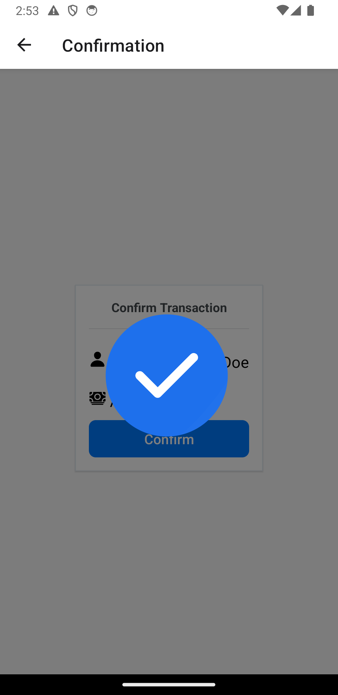

# MoneySend

This is a simple payment app that allows users to send money and view their transaction history. The app features a clean, modern design similar to popular payment apps like Google Pay.

## Screens

### Home Screen
- **Purpose**: Acts as the main screen of the app, providing options to navigate to different functionalities like sending money and viewing transaction history.
- **Key Features**: 
  - Welcome message.
  - Buttons to navigate to "Send Money" and "Transaction History" screens.
  - A clean, centered layout with attractive styling and icons for a professional look.

### Send Money Screen
- **Purpose**: Allows the user to input the amount they want to send.
- **Key Features**:
  - A text input field for entering the amount.
  - A button to proceed to the recipients' selection screen.
  - Clean design with a focus on user input.

### Recipients Screen
- **Purpose**: Displays a list of recipients for the user to choose from.
- **Key Features**:
  - A search bar to filter recipients.
  - Each recipient is displayed as a card in a list.
  - Selecting a recipient opens a modal to confirm the choice.
  - Clean and user-friendly interface.

### Confirmation Screen
- **Purpose**: Confirms the transaction details before processing.
- **Key Features**:
  - Displays selected recipient and amount.
  - Button to confirm the transaction.
  - Full-screen success animation and sound upon confirmation.
  - Modal for an additional confirmation step.
  - Smooth transition back to the home screen after confirmation.

### Transaction History Screen
- **Purpose**: Shows a history of all past transactions.
- **Key Features**:
  - Displays each transaction in a card format.
  - Clicking on a transaction card opens a modal with detailed information.
  - Clean and organized layout.

## Challenges Faced

1. **State Management**: Ensuring the selected recipient and transaction amount are correctly passed between screens required careful state management using React Context.
2. **Modal Handling**: Implementing modals to display detailed information and ensuring they function correctly across different screens involved managing their visibility and content dynamically.
3. **Animations**: Integrating a full-screen animation for the transaction confirmation was challenging, especially ensuring that they synchronized well and provided a smooth user experience.
4. **User Interface Design**: Creating a professional and aesthetically pleasing design involved selecting appropriate components and styling them to match a polished, modern look similar to popular payment apps like Google Pay.

## Conclusion

This project was a comprehensive exercise in building a polished and user-friendly payment application. The main focus was on creating a smooth and intuitive user experience, using modern design principles and interactive elements such as animations and modals.

By carefully managing state and ensuring seamless transitions between screens, we were able to create an app that not only looks good but also feels good to use. The integration of animations and sound added an extra layer of engagement, making the transaction process feel complete and satisfying.

This project taught us a lot about the importance of user experience and the technical challenges involved in creating a polished mobile application.

---

Feel free to reach out if you have any questions or need further assistance!
